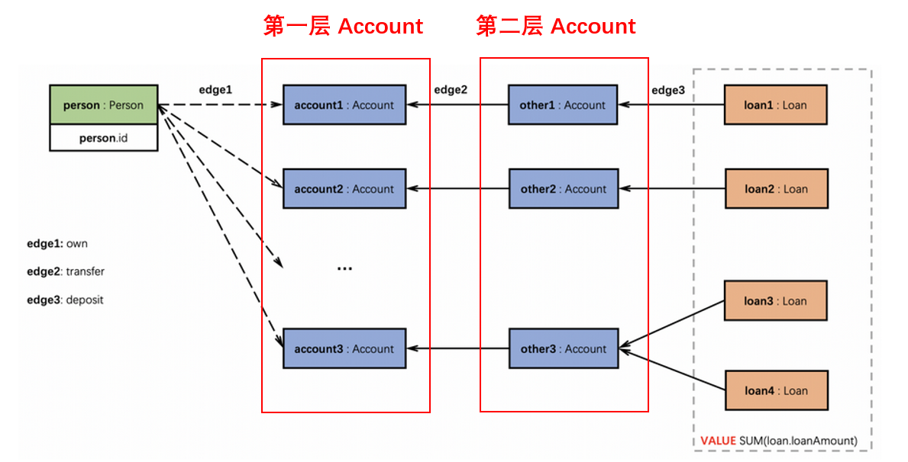

# 基于TuGraph Analytics的高性能图模式匹配算法设计

## 队伍

+ 名称： default13263780
+ 队员： 王晓庆、陈思睿
+ 指导教师： 程龚
+ 单位： 南京大学 WebSoft 实验室

## 代码运行

### 环境
JDK 1.8

Maven

### 安装依赖

克隆 [tugraph-analytics](https://github.com/TuGraph-family/tugraph-analytics/tree/master) 仓库，并运行 `mvn -DskipTests install` 编译并安装 `geaflow-assembly` 依赖

### zip 包

在本项目运行 `mvn package` ，并在 `target` 文件夹中找到 `TugraphCompetition-jar-with-dependencies.jar` ，将其和根目录下的 `run.sh` 打包成一个 zip 文件，即为比赛提交的压缩文件。

## 实现思路

### 构图

顶点的类型有 Loan、Account、Person，Key 值为 Id 和 顶点类型的 Pair，顶点的值为一个 `VertexValue`，该类用于保存各个 Case 计算的中间结果。

边的类型有 PersonOwnAccount、LoanDepositAccount、PersonApplyLoan、AccountTransferAccount、PersonGuaranteePerson，为减少边的数量，除掉 AccountTransferAccount， 我们只在其中一个必要的点上存下该边，例如对于 LoanDepositAccount，我们只将该边的信息存储到 Loan 顶点上。

### 匹配

主要实现在 `com.antgroup.geaflow.fusion.Fusion` 中，我们分析了每个 Case 的执行流程，再对这些流程进行合并。

#### Case 1

+ Iteration 1 ： 第一层 Account 顶点通过 PersonOwnAccount 获得 owner（144-148 行），并将 owner 发送给第二层 Account（176-180 行）； Loan 将 LoanId 和 LoanAmount 的 Pair 通过 LoanDepositAccount 发送给第二层 Account 顶点（125-126 行）。
+ Iteration 2 ：第二层 Account 顶点在收到 owner 之后形成 `ownerList` （204 -205 行），收到 LoanId 和 LoanAmount 的 Pair 形成 `depositList` （244-246 行），对两个 list 去重之后，将 `depositList` 发送给每个 owner （250-257 行）
+ Iteration 3 :  owner 对收到的 `depositList` 进行合并和去重，并对 LoanAmount 求和得到 Case 1 的答案，保存在 `VertexValue.ret1` 中（286-293 行）

#### Case 2

设寻找的三元环为 x->y->z->x，不失一般性，可以假设 x 为三个顶点中 ID 最小的。

+ Iteraion 1 ：对每个 Account ，统计比自己 ID 小的 Account 的入边和出边，保存到 `VertexValue`  中（154-157行和166-168行），此时完成了对 y 和 z 的边表的处理，我们将 z 的出边边表发送给 y（183-192 行）
+ Iteration 2 ：y 收到 z 的出边边表后，和自己的入边边表进行 join ，找到对应的 x ，在找到三元环后，给 z 和 x 分别发送 message，更新其答案（218-242 行）
+ Iteration 3 ：节点收到 message 之后更新答案到 `VertexValue.ret2` （259-264 行）

#### Case 3

在 Iteration 1 直接累加入边和出边的 Amount 即可（151-152 行和 163-164 行)，将结果保存到 `VertexValue.ret3` 中 （195-198 行）

#### Case 4

+ Iteration 1 ： Loan 顶点将自己的 Amount 通过 PersonApplyLoan 发送给对应的 Person（128-129 行），每个 Person 维护自己在三跳内能访问到的 Person 的集合 `guranteeSet` （ 270-272 行）
+ Iteration 2： Person 顶点收到 LoanAmount 后进行累加，并将得到的 amount 和 PersionId 的 Pair 发送给其他 Person （274-279 行）
+ Iteration 3-5： 每次 Person 收到其他 Person 发送的 Amount 时，会合并到 `guranteeSet` 中，对于新增的Amount，形成 `msgList` （305-315 行），发送给其他的 Person ，直到第5轮结束（318-325行）。

#### 合并

在上面的 Case 中，我们将任务按照 Iteraion 进行了分解，因此，在合并时，直接识别当前顶点的类型和 Iteration ，直接将每个 Case 在该轮次的任务进行合并即可。

对于传递的 Message ，我们存储成 Object ，并通过 Object 的类型来识别这是哪个 Case 中的何种类型的消息，由于 Case 数较少，这种做法在实践中并没有出现类型相同的冲突。

### 输出

由于我们把答案存储在 `Vertexvalue` 的 ret 值中，因此对于每个点，我们遍历其 ret 值，将答案记录到对应的 list 中，最后再进行排序输出。